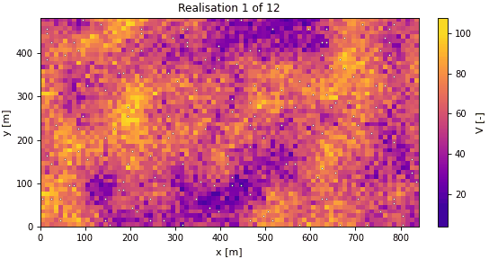
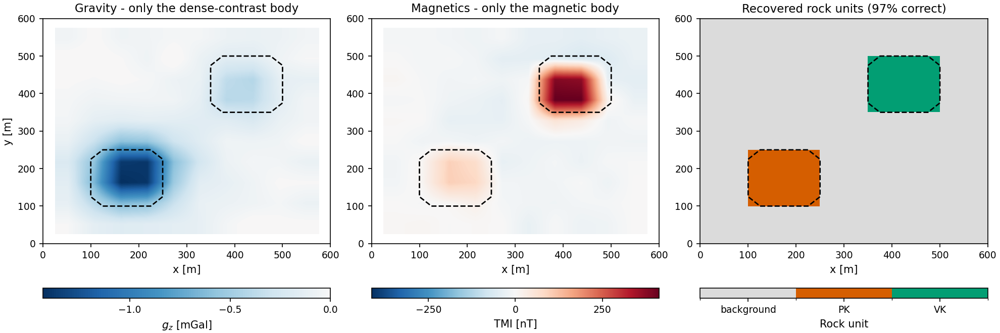

# Welcome to GeoBrain!

<div align="center">


[](https://www.python.org/)
[](https://pytorch.org/)
[](LICENSE)
[](geobrain/_version.py)

</div>

## What is the GeoBrain Project?

**GeoBrain** is an open, modular, and extensible platform for **Geo**scientific **B**ayesian **R**easoning with **A**rtificial **In**telligence, designed specifically for **integrated subsurface modeling**.

By combining **differentiable physics**, **Bayesian inference**, and **deep learning**, GeoBrain enables end-to-end workflows for subsurface characterization, from geomodeling and rock physics to geophysical simulation and inversion. Every forward model is a composable operator, every operator declares how it differentiates, and the same problem object serves a deterministic optimiser and a posterior sampler alike.

### The core architecture

Four contracts make that possible. Everything else, from the physics families to the samplers to the neural parameterizations, is something you can add without touching them.

- **An operator is a contract, not a function.** Every forward model is a `ForwardOperator` that declares a `DifferentiabilitySpec`: its trainable inputs, its outputs, and *how* its gradient is obtained (full autograd, an implicit adjoint, or a hand-written VJP). The declaration is machine-checked against finite differences, so "this is differentiable" is a statement the platform can be held to rather than a promise in a docstring.
- **Physics composes with `@`.** Chain operators in series (`Gravity2D(survey) @ GardnerOperator()`), run them in parallel as an `OperatorBundle`, and the composition's contract is *derived* from its links: trainable inputs from the entry link, outputs from the terminal link, differentiability level the weakest of the members. A chain that cannot be honoured is refused when you build it, not when you run it.
- **A mesh declares capabilities; physics declares requirements.** `TensorMesh` (uniform or graded), `OctreeMesh` and `UnstructuredMesh` each satisfy a set of named protocols (`UniformMesh`, `StructuredMesh`, `GeometryMesh`, `PrismGeometryMesh`, `ConnectivityMesh`), and each physics declares which it needs, so "this kernel cannot run on that mesh" is caught by the type system rather than by a wrong answer. A differentiable `MeshProjection` bridges them, which is what lets a joint inversion run the wave equation on a structured grid and gravity straight on triangles, and still return one gradient from one backward pass.
- **One problem, two doors.** The same `InverseProblem` serves a deterministic optimiser (`create_inverter().run()`) and a posterior sampler (`as_posterior().sample("nuts")`). Uncertainty quantification is a method call on the object you already built, not a second pipeline that has to be kept in step with the first.

### Key Features

- **Differentiable Multiphysics Modeling**: geostatistics, rock physics, seismic, electromagnetics, potential fields and reservoir flow in one computational graph.
- **Automatic Differentiation**: inversion without hand-crafted gradients. Where autograd is the wrong tool, an implicit adjoint or a custom VJP is declared and checked against finite differences.
- **Mesh Taxonomy with Capability Contracts**: tensor, graded, octree and unstructured meshes; physics runs where it is allowed to run.
- **Deep Neural Network Integration**: Deep Image Prior and latent-space reparameterizations that compose onto a physics chain like any other operator.
- **Bayesian Gradient-Informed Samplers**: HMC, NUTS, Langevin and SVGD behind one `Posterior`, with change-of-variable transforms and R-hat / ESS diagnostics.
- **Geostatistics**: the kriging family, sequential and indicator simulation, variogram fitting with diagnostics, declustering and transforms.
- **Decision Under Uncertainty**: the efficacy of information of a proposed measurement, scored cell by cell from a prior ensemble. What to measure next, costed before it is measured.
- **Plug-and-Play Architecture**: each physics module is self-contained and composable, so new physics goes in without rewriting core logic.

---

## Gallery

Every image below is the unedited output of a script in [`examples/`](examples/): one tile per physics family, plus the two things the families are there to serve: a model of the earth, and a decision.

<table>
<tr>
<td align="center"><b>Seismic: full-waveform inversion, band by band</b><br><br><sub>Marmousi II from a smoothed start, 2 to 11 Hz</sub></td>
<td align="center"><b>Flow: two phases, four wells, one adjoint</b><br><br><sub>The streaks decide who waters out first</sub></td>
</tr>
<tr>
<td align="center"><b>Electrical: DC resistivity under topography</b><br><br><sub>Chi-squared says when to stop, not an iteration count</sub></td>
<td align="center"><b>Induced polarization: a second image of one ground</b><br><br><sub>Resistivity finds one body, chargeability the other</sub></td>
</tr>
<tr>
<td align="center"><b>Electromagnetics: frequency-domain induction</b><br><br><sub>One airborne sounding, four decades, a layered earth back out</sub></td>
<td align="center"><b>Potential fields: gravity and magnetics</b><br><br><sub>Remanence and latitude change the anomaly, not the body</sub></td>
</tr>
<tr>
<td align="center"><b>Geostatistics: one estimate, many realisations</b><br><br><sub>What the ensemble does not know, flickering</sub></td>
<td align="center"><b>Rock physics: petrophysically guided joint inversion</b><br><br><sub>Gravity and magnetics answering which rock is where</sub></td>
</tr>
<tr>
<td align="center"><b>Two meshes, one backward pass</b><br><br><sub>A differentiable projection bridges the physics</sub></td>
<td align="center"><b>Decision: efficacy of information</b><br><br><sub>Which borehole would change the decision, before it is paid for</sub></td>
</tr>
</table>

---

## Installation

```bash
git clone https://github.com/GeoBrain-Project/GeoBrain.git
cd GeoBrain
pip install -e ".[examples]"
```

The base install is `torch`, `numpy`, `scipy` and `jsonschema`, which is what
`import geobrain` needs. The rest is opt-in, keyed to the subpackage that
requires it: `vis` for the plotting helpers, `io` for the SEG-Y / LAS / HDF5 /
VTK readers and writers, `viewer` for the interactive 3-D scene, `mesh` for
triangulating an unstructured mesh, `parallel` for thread pinning in the
geostatistical simulators. `[examples]` is what the gallery needs; `[all]`
is everything.

**Requirements**: Python 3.10+, PyTorch 2.0+, NumPy >= 1.22, SciPy >= 1.8, Matplotlib >= 3.5

### Example Data

Everything in the gallery generates its own earth from a seed except the seismic pair, which reads a window of the **Marmousi II** benchmark. Those sections are 148 MB each, past what a git host accepts in one file, so they are published as release assets and fetched on demand:

```bash
python examples/data/fetch_marmousi.py
```

The script verifies each section against a recorded SHA-256, because a truncated SEG-Y does not fail loudly: it reads back as a shorter section and the inversion runs on the wrong earth. Nothing else in the gallery needs it.

---

## Quick Start

```python
import torch
from geobrain.core import ForwardContext, ModelState
from geobrain.mesh import TensorMesh
from geobrain.physics.rock.models import GardnerOperator
from geobrain.physics.potential import Gravity2D, PotentialSurvey2D
from geobrain.inverse import GaussianLikelihood, InverseProblem
from geobrain.optim import LBFGSConfig
from geobrain.bayes import PositiveTransform

torch.manual_seed(0)
# 1. A mesh, and a chain of operators on it
mesh = TensorMesh(shape=(12, 24), spacing=(25.0, 25.0))
ctx = ForwardContext.of(mesh=mesh)
stations = torch.stack([torch.linspace(0.0, 600.0, 25, dtype=torch.float64),
                        torch.full((25,), 1.0, dtype=torch.float64)], dim=1)

#    vp -> rho (Gardner) -> gz (Talwani).  '@' is operator composition, and
#    the chain derives its own contract from the links.
forward = Gravity2D(PotentialSurvey2D(stations)) @ GardnerOperator()
print(forward.differentiability)      # trainable inputs, outputs, gradient mode

# 2. Synthetic data from a known earth
vp_true = 1800.0 + 40.0 * torch.arange(12, dtype=torch.float64)[:, None]
vp_true = vp_true.expand(12, 24).clone()
vp_true[4:8, 8:16] += 400.0
with torch.no_grad():
    observed = forward(ModelState({"vp": vp_true}), ctx).data["gz"]
observed = observed + 2.0e-8 * torch.randn_like(observed)

# 3. ONE problem object: it serves both solvers
problem = InverseProblem(forward=forward, observed={"gz": observed},
                         likelihood=GaussianLikelihood(std=2.0e-8))

# 4a. Deterministic: the best-fitting model
start = {"vp": 1800.0 + 40.0 * torch.arange(12, dtype=torch.float64)[:, None]}
start = {"vp": start["vp"].expand(12, 24).clone()}
result = problem.create_inverter(
    params=start, optimizer=LBFGSConfig(lr=1.0, max_iter=30),
    bounds={"vp": (1500.0, 4000.0)}, ctx=ctx).run(n_iters=10)
print(f"misfit {result.best_loss:.4g} after {result.completed_iters} iters")

# 4b. Bayesian: the models still standing, same problem, one method call
posterior = problem.as_posterior(transforms={"vp": PositiveTransform()})
draws = posterior.sample("nuts", params=result.best_params, n_iters=100,
                         ctx=ctx, warmup=50, max_depth=5)
print("posterior sd [m/s]:", draws.samples["vp"].std(0).mean().item())
```

---

## Project Structure

```
geobrain/
├── core/              # Operator, ForwardOperator, ModelState, DifferentiabilitySpec
├── mesh/              # Tensor / graded / octree / unstructured / cylindrical
│                      #   + MeshProjection and discrete differential operators
├── geomodel/          # Geological model generation
│   ├── geostats/      # Kriging family, SGSIM/DSSIM/SISIM, FFT-MA, variograms,
│   │                  #   MPS (SNESIM, FILTERSIM, direct sampling), plurigaussian
│   ├── implicit/      # Differentiable implicit modelling (contacts, dips, faults)
│   └── generative/    # VAE, GAN, diffusion simulators
├── physics/           # Multiphysics forward operators
│   ├── rock/          # Effective medium, granular, fluid substitution, empirical
│   ├── wave/          # Acoustic/elastic/visco FDTD, Helmholtz, AVO, wavelets
│   ├── em/            # DC, IP, SIP, MT, FDEM, TEM, CSEM, airborne, SP
│   ├── potential/     # Gravity 2D/3D, magnetics with remanence, Euler
│   └── flow/          # Differentiable two-phase reservoir simulation
├── inverse/           # InverseProblem, likelihoods, priors, waveform misfits
├── optim/             # Inverter, Adam/L-BFGS, regularizers, gradient processors
├── bayes/             # HMC, NUTS, Langevin, SVGD; transforms; R-hat / ESS
├── nn/                # Bayesian layers, decoders, reparameterization operators
├── io/                # SEG-Y, LAS, EDI, UBC, HDF5, artifacts
├── vis/               # 2-D and 3-D plotting, geoscience colormaps
├── datasets/          # Built-in benchmark-style tables
└── decision/          # Efficacy / value of information, closed-loop management

examples/
├── 00_showcase/       # See it work
├── 01_architecture/   # Understand it
├── 02_geomodel/       # Build the earth
├── 03_physics/        # Tour the physics
├── 04_decision/       # Decide what next
└── data/              # fetch script for the Marmousi II sections
```

---

## Documentation

`docs/` holds a hand-written site covering installation, a quick start,
the architecture and this gallery, built with Sphinx:

```bash
pip install sphinx sphinx-book-theme myst-parser sphinx-design sphinx-copybutton
sphinx-build -b html docs docs/_build/html
```

Every code block in it is run and checked against the version of `geobrain`
sitting beside it.

---

## Tutorials

Twenty-nine scripts in five parts, meant to be read in order. Each is seeded, runs on CPU, prints its measurements as it goes, and writes one figure to its part's `out/`, three to six panels built through a shared figure toolkit so that a reader who has learned one figure has learned them all. Three of them also write a GIF, where time is the thing being shown. Each part has its own README with the measured claim of every script.

### Part 0: [See it work](examples/00_showcase/)

| # | Example | What it proves |
|---|---------|----------------|
| 01 | [gravity_inversion](examples/00_showcase/01_gravity_inversion.py) | The whole platform in three objects: physics, problem, solver |
| 02 | [operator_composition](examples/00_showcase/02_operator_composition.py) | Serial chains with `@`, parallel channels with `OperatorBundle`, one backward |
| 03 | [mesh_projection_joint_inversion](examples/00_showcase/03_mesh_projection_joint_inversion.py) | Joint inversion across an unstructured and a structured mesh |
| 04 | [deterministic_bayes_unified](examples/00_showcase/04_deterministic_bayes_unified.py) | Deterministic and Bayesian from one problem, one keyword apart |
| 05 | [differentiability_modes](examples/00_showcase/05_differentiability_modes.py) | Three gradient mechanisms, all checked against finite differences |
| 06 | [neural_network_integration](examples/00_showcase/06_neural_network_integration.py) | The unknown as an image, a decoder's weights, or its latent code |

### Part 1: [Understand it](examples/01_architecture/)

| # | Example | What it opens |
|---|---------|---------------|
| 01 | [operator_contract](examples/01_architecture/01_operator_contract.py) | ModelState in, ForwardOutput out, and the contract between |
| 02 | [mesh_taxonomy](examples/01_architecture/02_mesh_taxonomy.py) | Four meshes, one domain, and the capabilities that decide what may run |
| 03 | [composition_rules](examples/01_architecture/03_composition_rules.py) | How a chain's contract is derived from its links |
| 04 | [differentiability_levels](examples/01_architecture/04_differentiability_levels.py) | The ladder from full autograd to a declared custom VJP |
| 05 | [inversion_toolbox](examples/01_architecture/05_inversion_toolbox.py) | Regularizers, bounds and IRLS: where your geology goes |
| 06 | [bayesian_workflow](examples/01_architecture/06_bayesian_workflow.py) | Chains, R-hat, ESS, and the posterior predictive check |
| 07 | [custom_operator](examples/01_architecture/07_custom_operator.py) | Two hooks and two declarations buy you the rest of the platform |
| 08 | [data_io_and_figures](examples/01_architecture/08_data_io_and_figures.py) | SEG-Y, VTK, HDF5 in; `geobrain.vis` out |

### Part 2: [Build the earth](examples/02_geomodel/)

| # | Example | The step |
|---|---------|----------|
| 01 | [estimation_vs_simulation](examples/02_geomodel/01_estimation_vs_simulation.py) | Kriging for the best map, simulation for the right variability |
| 02 | [variogram](examples/02_geomodel/02_variogram.py) | The input everything downstream inherits, and its own uncertainty |
| 03 | [kriging_estimators](examples/02_geomodel/03_kriging_estimators.py) | Simple, ordinary, universal: what each assumes about the mean |
| 04 | [categorical_and_cutoffs](examples/02_geomodel/04_categorical_and_cutoffs.py) | Estimate the probability; do not threshold the estimate |
| 05 | [multivariate](examples/02_geomodel/05_multivariate.py) | A densely sampled proxy is data: collocated cokriging |
| 06 | [implicit_modelling](examples/02_geomodel/06_implicit_modelling.py) | Geometry from contacts and dips, differentiable with respect to them |
| 07 | [case_study](examples/02_geomodel/07_case_study.py) | The whole sequence, ending in a probability rather than a map |

### Part 3: [Tour the physics](examples/03_physics/)

| # | Example | The family |
|---|---------|------------|
| 01 | [seismic_fwi](examples/03_physics/01_seismic_fwi.py) | Multi-scale full-waveform inversion on Marmousi II |
| 02 | [dc_resistivity](examples/03_physics/02_dc_resistivity.py) | Topography as part of the model; chi-squared as the stopping rule |
| 03 | [induced_polarization](examples/03_physics/03_induced_polarization.py) | Chargeability as an image DC is blind to |
| 04 | [petrophysical_joint_inversion](examples/03_physics/04_petrophysical_joint_inversion.py) | Gravity and magnetics answering *which rock is where* |
| 05 | [em_induction](examples/03_physics/05_em_induction.py) | An airborne sounding inverted for a layered earth |
| 06 | [potential_fields](examples/03_physics/06_potential_fields.py) | Gravity answers once; magnetics differently at every latitude |
| 07 | [reservoir_flow](examples/03_physics/07_reservoir_flow.py) | A five-spot, and one adjoint that prices every cell |

### Part 4: [Decide what to measure next](examples/04_decision/)

| # | Example | The question |
|---|---------|--------------|
| 01 | [borehole_efficacy_of_information](examples/04_decision/01_borehole_efficacy_of_information.py) | Where should the next hole go, and how deep: costed before drilling |

---

## Module Highlights

### Mesh (`geobrain.mesh`)

| Kind | Declares | Used for |
|------|----------|----------|
| `TensorMesh` | uniform or per-axis graded cell widths | finite differences, most physics |
| `OctreeMesh` | refined leaves over a base grid | local refinement without a global cost |
| `UnstructuredMesh` | vertices, cells, face connectivity | geology that does not follow a grid |
| `CylindricalMesh` | r-z-θ geometry | borehole and loop-source problems |
| `MeshProjection` | a differentiable map between two meshes | letting each physics use the mesh it needs |

Discrete operators (`cell_gradient`, `edge_curl`, `face_divergence`, averaging) and capability protocols (`StructuredMesh`, `GeometryMesh`, `PrismGeometryMesh`, `ConnectivityMesh`) that physics declares against.

### Geological Modeling (`geobrain.geomodel`)

| Category | Methods |
|----------|---------|
| Kriging | Simple, Ordinary, Universal, Block, Indicator, Soft-indicator, Collocated cokriging |
| Simulation | SGSIM, DSSIM, SISIM, CoSGSIM, LUSIM, FFT-MA, plurigaussian |
| Multiple-point | SNESIM, FILTERSIM, direct sampling, image quilting |
| Generative | VAE, GAN and diffusion simulators |
| Variograms | experimental, directional, cross-variograms, automatic fitting with diagnostics |
| Transforms | normal score, Box-Cox, Yeo-Johnson, indicator encoding, detrending, declustering |
| Implicit | `ImplicitModel` from surface points, orientations, series and faults, differentiable |
| Validation | k-fold, leave-one-out, post-processing of simulations and indicator kriging |

### Rock Physics (`geobrain.physics.rock`)

| Category | Models |
|----------|--------|
| Effective medium | Voigt-Reuss-Hill, Hashin-Shtrikman, self-consistent, Hudson, Sayers-Kachanov |
| Granular media | Hertz-Mindlin, soft sand, stiff sand, contact cement |
| Fluid substitution | Gassmann, Wood, Batzle-Wang, Biot high-frequency limits |
| Empirical | Gardner, and the rock-physics-template family |
| Petrophysics | Kozeny-Carman permeability, Archie resistivity |

### Wave Physics (`geobrain.physics.wave`)

| Component | Details |
|-----------|---------|
| Time domain | `Acoustic2D/3D`, `Elastic2D/3D`, `ViscoAcoustic2D`, `ViscoElastic2D`, anisotropic elastic |
| Frequency domain | `Helmholtz2D` with an implicit adjoint |
| Reflectivity | Zoeppritz, Aki-Richards, Shuey, `ConvolutionalAVO` |
| Wavelets | Ricker, Gaussian, Ormsby, Klauder |

### Electromagnetics (`geobrain.physics.em`)

| Method | Operators |
|--------|-----------|
| Galvanic | `DC2D`, `DC25D`, `DC3D`, `IP2D`, `IP3D`, `SIP` (Cole-Cole), `SelfPotential2D` |
| Natural source | `MT1D`, `MT2D`, `MT3D` |
| Frequency domain | `FDEM3D`, `FDEMCyl`, `HEM`, `CSEM1D` (marine) |
| Time domain | `TEM1D`, `TEM3D`, `VTEM`, with waveform support |

### Potential Fields (`geobrain.physics.potential`)

`Gravity2D` (Talwani), `Gravity3D` (prisms), `Magnetic3D` and `MagneticVector3D` with an `EarthField` and explicit remanent magnetisation, plus Euler deconvolution.

### Flow Simulation (`geobrain.physics.flow`)

Two-phase oil-water on structured grids; wells with rate or BHP control, groups and perforations; adaptive implicit time stepping; and gradients that flow through the whole schedule. `TransientFlowOperator`, `ParametricFlowOperator`, `WellObservationOperator`.

### Inversion (`geobrain.inverse`, `geobrain.optim`)

| Feature | Details |
|---------|---------|
| Problem | `InverseProblem` (forward + observed + likelihood + prior), `JointProblem` for several physics |
| Likelihoods | Gaussian, per-channel, and waveform misfits: L1/L2, Huber, Student-t, envelope, travel-time, global correlation, Wasserstein |
| Optimizers | Adam, L-BFGS with strong-Wolfe line search |
| Regularizers | smallness, smoothness, depth weighting, cross-gradient, Gaussian-mixture petrophysical priors |
| Control | bounds, masks, freezing, gradient smoothing, norm clipping, NaN guards, cancellation |

### Bayesian Inference (`geobrain.bayes`)

| Sampler | Method | Best for |
|---------|--------|----------|
| `NUTS` | No-U-Turn Sampler | the default: tunes its own trajectory length |
| `HMC` | Hamiltonian Monte Carlo | when you can tune it, and want to |
| `LangevinDynamics` | ULA / MALA | cheap steps, a good debugging target |
| `SVGD` | Stein variational gradient descent | ensembles, where a chain is not affordable |

With `PositiveTransform` / `IntervalTransform` for constrained parameters, `run_chains` for dispersed starts, and `split_rhat` / `ess` / `summarize` for the diagnostics that decide whether to believe the answer.

### Neural Networks (`geobrain.nn`)

`WeightReparameterization` (Deep Image Prior) and `LatentReparameterization` compose onto a physics chain with `@`, so the unknown can be an image, a network's weights, or a latent code without touching the forward model. Plus Bayesian layers (`LinearFlipout`, `Conv2dFlipout`, `Conv3dFlipout`), convolutional decoders and coordinate MLPs.

### I/O and Visualization (`geobrain.io`, `geobrain.vis`)

SEG-Y, LAS, EDI (magnetotelluric), UBC mesh/model, HDF5 and artifact save/load. Plotting for 2-D fields on any mesh kind (`plot_field_2d`, `plot_field_tripcolor`, `plot_mesh_quadtree`), sections, station maps, convergence, sensitivity and 3-D scenes (`Scene3D`, `Slicer`, `view_geomodel`, `view_octree`).

### Decision Under Uncertainty (`geobrain.decision`)

`SpatialDecisionAccuracy` (efficacy of information), `ValueOfInformation`, `MutualInformationEstimator`, `EnsembleUpdater` and `ClosedLoopManager`, for observe-update-decide cycles.

---

## Citation

If you use GeoBrain in your research, please cite it. GitHub reads
[CITATION.cff](CITATION.cff) for the machine-readable record; the BibTeX
below says the same thing:

```bibtex
@software{GeoBrain2026,
  title   = {GeoBrain: An End-to-End Differentiable Platform for Integrated Subsurface Modeling},
  author  = {Liu, Mingliang},
  year    = {2026},
  version = {0.2.0},
  license = {Apache-2.0},
  url     = {https://github.com/GeoBrain-Project/GeoBrain}
}
```

---

## License

This project is licensed under the Apache License 2.0. See [LICENSE](LICENSE)
for the full text.

GeoBrain redistributes two third-party scientific assets under their own
terms: the Key (2012) Hankel digital-linear-filter coefficient tables
(CC-BY-4.0) and a port of the Cephes J0 approximation (BSD-3-Clause). Both
are attributed in [THIRD-PARTY-NOTICES.md](THIRD-PARTY-NOTICES.md), with
per-asset provenance and SHA-256 digests shipped beside the assets
themselves.

---

## Contact

- **Author**: Mingliang Liu
- **Email**: mingliangliu@sdu.edu.cn
