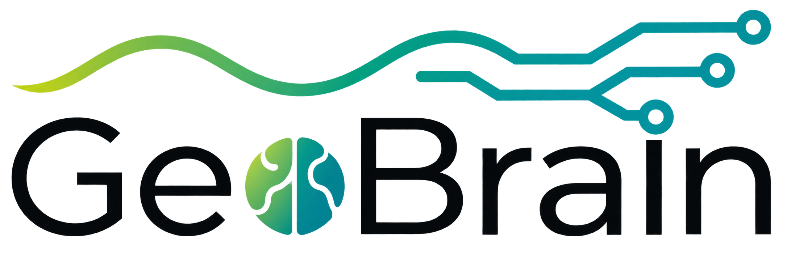
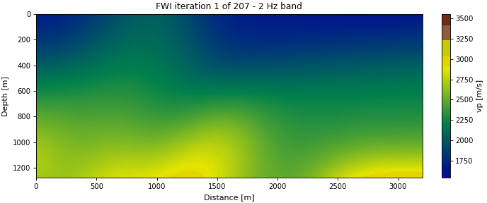
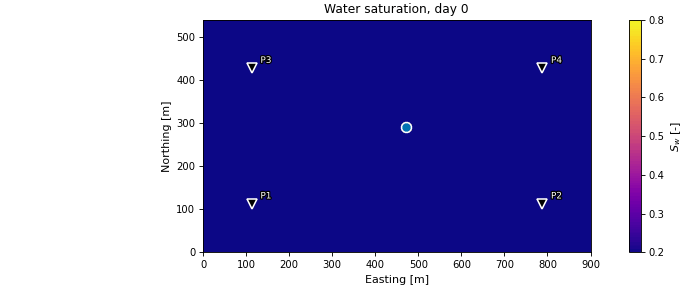
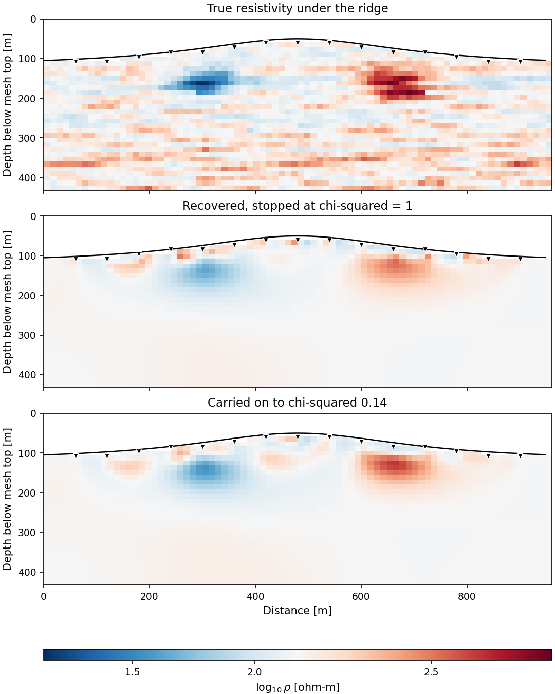
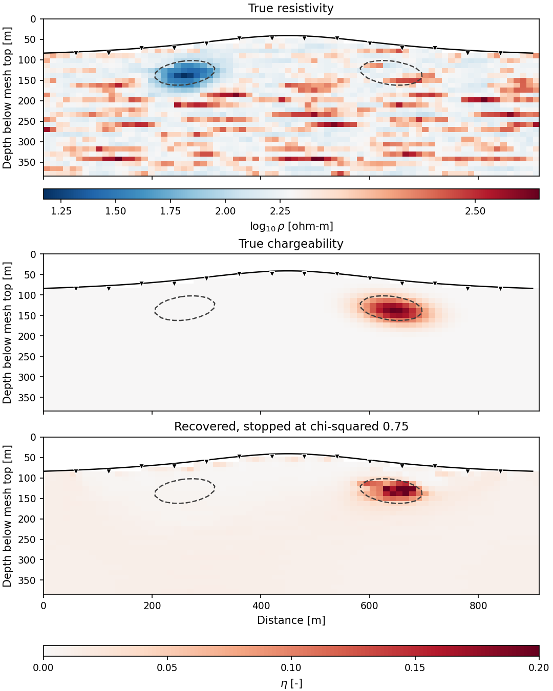
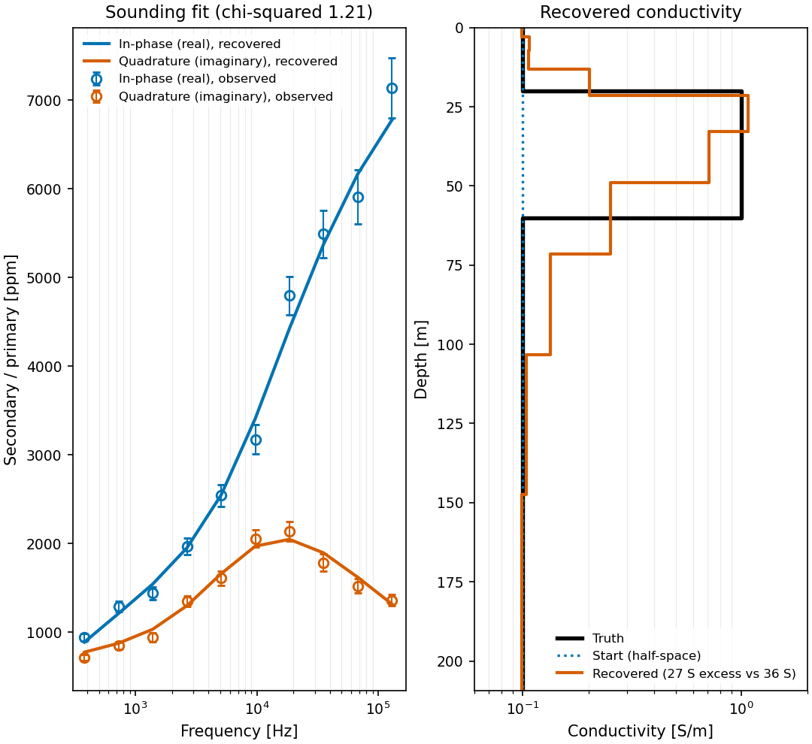
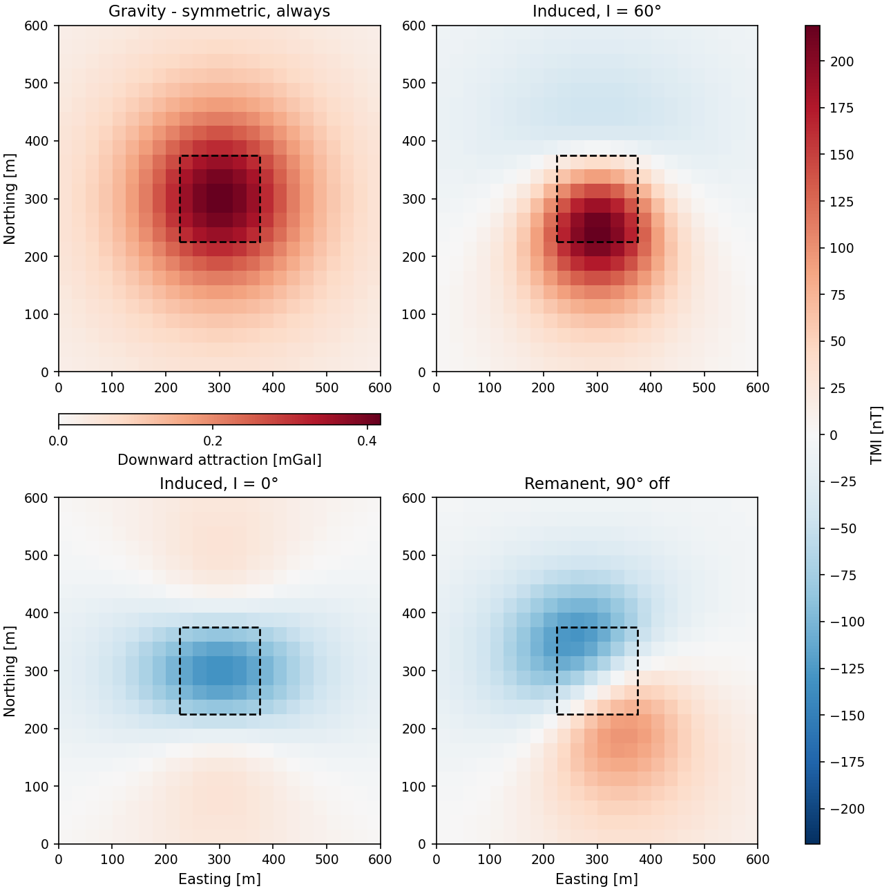
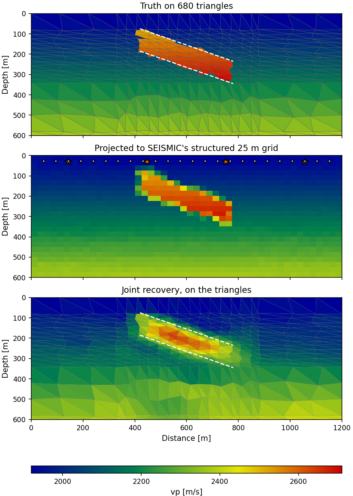
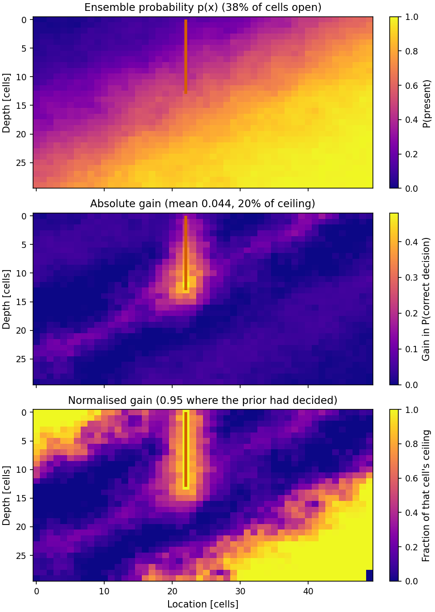

# Welcome to GeoBrain!

<div align="center">



[](https://www.python.org/)
[](https://pytorch.org/)
[](LICENSE)
[](geobrain/_version.py)

</div>

## What is the GeoBrain Project?

**GeoBrain** is an open, modular, and extensible platform for **Geo**scientific **B**ayesian **R**easoning with **A**rtificial **In**telligence, designed specifically for **integrated subsurface modeling**.

By combining **differentiable physics**, **Bayesian inference**, and **deep learning**, GeoBrain enables end-to-end workflows for subsurface characterization, from geomodeling and rock physics to geophysical simulation and inversion. Every forward model is a composable operator, every operator declares how it differentiates, and the same problem object serves a deterministic optimiser and a posterior sampler alike.


<p align="center">

&nbsp;

</p>
<p align="center">
<b>Seismic: full-waveform inversion, band by band</b>
&nbsp;&nbsp;&middot;&nbsp;&nbsp;
<b>Flow: two phases, four wells, one adjoint</b>
</p>


### The core architecture

Four contracts make that possible. Everything else, from the physics families to the samplers to the neural parameterizations, is something you can add without touching them.

- **An operator is a contract, not a function.** Every forward model is a `ForwardOperator` that declares a `DifferentiabilitySpec`: its trainable inputs, its outputs, and *how* its gradient is obtained (full autograd, an implicit adjoint, or a hand-written VJP). The declaration is machine-checked against finite differences, so "this is differentiable" is a statement the platform can be held to rather than a promise in a docstring.
- **Physics composes with `@`.** Chain operators in series (`Gravity2D(survey) @ GardnerOperator()`), run them in parallel as an `OperatorBundle`, and the composition's contract is *derived* from its links: trainable inputs from the entry link, outputs from the terminal link, differentiability level the weakest of the members. A chain that cannot be honoured is refused when you build it, not when you run it.
- **A mesh declares capabilities; physics declares requirements.** `TensorMesh` (uniform or graded), `OctreeMesh` and `UnstructuredMesh` each satisfy a set of named protocols (`UniformMesh`, `StructuredMesh`, `GeometryMesh`, `PrismGeometryMesh`, `ConnectivityMesh`), and each physics declares which it needs, so "this kernel cannot run on that mesh" is caught by the type system rather than by a wrong answer. A differentiable `MeshProjection` bridges them, which is what lets a joint inversion run the wave equation on a structured grid and gravity straight on triangles, and still return one gradient from one backward pass.
- **One problem, two doors.** The same `InverseProblem` serves a deterministic optimiser (`create_inverter().run()`) and a posterior sampler (`as_posterior().sample("nuts")`). Uncertainty quantification is a method call on the object you already built, not a second pipeline that has to be kept in step with the first.

### Key Features

- **Differentiable Multiphysics Modeling**: geostatistics, rock physics, seismic, electromagnetics, potential fields and reservoir flow in one computational graph.
- **Automatic Differentiation**: inversion without hand-crafted gradients. Where autograd is the wrong tool, an implicit adjoint or a custom VJP is declared and checked against finite differences.
- **Mesh Taxonomy with Capability Contracts**: tensor, graded, octree and unstructured meshes; physics runs where it is allowed to run.
- **Deep Neural Network Integration**: Deep Image Prior and latent-space reparameterizations that compose onto a physics chain like any other operator.
- **Bayesian Gradient-Informed Samplers**: HMC, NUTS, Langevin and SVGD behind one `Posterior`, with change-of-variable transforms and R-hat / ESS diagnostics.
- **Geostatistics**: the kriging family, sequential and indicator simulation, variogram fitting with diagnostics, declustering and transforms.
- **Decision Under Uncertainty**: the efficacy of information of a proposed measurement, scored cell by cell from a prior ensemble. What to measure next, costed before it is measured.
- **Plug-and-Play Architecture**: each physics module is self-contained and composable, so new physics goes in without rewriting core logic.

---

## Gallery

One tile per physics family, plus the two things the families are there to
serve: a model of the earth, and a decision. Every image is the unedited
output of a script in [`examples/`](examples/).

<table>
<tr>
<td align="center"><b>Electrical: DC resistivity under topography</b><br><br><sub>Chi-squared says when to stop, not an iteration count</sub></td>
<td align="center"><b>Induced polarization: a second image of one ground</b><br><br><sub>Resistivity finds one body, chargeability the other</sub></td>
</tr>
<tr>
<td align="center"><b>Electromagnetics: frequency-domain induction</b><br><br><sub>One airborne sounding, four decades, a layered earth back out</sub></td>
<td align="center"><b>Potential fields: gravity and magnetics</b><br><br><sub>Remanence and latitude change the anomaly, not the body</sub></td>
</tr>
<tr>
<td align="center"><b>Two meshes, one backward pass</b><br><br><sub>A differentiable projection bridges the physics</sub></td>
<td align="center"><b>Decision: efficacy of information</b><br><br><sub>Which borehole would change the decision, before it is paid for</sub></td>
</tr>
</table>

---

## Quick Start

```python
import torch
from geobrain.core import ForwardContext, ModelState
from geobrain.mesh import TensorMesh
from geobrain.physics.rock.models import GardnerOperator
from geobrain.physics.potential import Gravity2D, PotentialSurvey2D
from geobrain.inverse import GaussianLikelihood, InverseProblem
from geobrain.optim import LBFGSConfig
from geobrain.bayes import PositiveTransform

torch.manual_seed(0)
# 1. A mesh, and a chain of operators on it
mesh = TensorMesh(shape=(12, 24), spacing=(25.0, 25.0))
ctx = ForwardContext.of(mesh=mesh)
stations = torch.stack([torch.linspace(0.0, 600.0, 25, dtype=torch.float64),
                        torch.full((25,), 1.0, dtype=torch.float64)], dim=1)

#    vp -> rho (Gardner) -> gz (Talwani).  '@' is operator composition, and
#    the chain derives its own contract from the links.
forward = Gravity2D(PotentialSurvey2D(stations)) @ GardnerOperator()
print(forward.differentiability)      # trainable inputs, outputs, gradient mode

# 2. Synthetic data from a known earth
vp_true = 1800.0 + 40.0 * torch.arange(12, dtype=torch.float64)[:, None]
vp_true = vp_true.expand(12, 24).clone()
vp_true[4:8, 8:16] += 400.0
with torch.no_grad():
    observed = forward(ModelState({"vp": vp_true}), ctx).data["gz"]
observed = observed + 2.0e-8 * torch.randn_like(observed)

# 3. ONE problem object: it serves both solvers
problem = InverseProblem(forward=forward, observed={"gz": observed},
                         likelihood=GaussianLikelihood(std=2.0e-8))

# 4a. Deterministic: the best-fitting model
start = {"vp": 1800.0 + 40.0 * torch.arange(12, dtype=torch.float64)[:, None]}
start = {"vp": start["vp"].expand(12, 24).clone()}
result = problem.create_inverter(
    params=start, optimizer=LBFGSConfig(lr=1.0, max_iter=30),
    bounds={"vp": (1500.0, 4000.0)}, ctx=ctx).run(n_iters=10)
print(f"misfit {result.best_loss:.4g} after {result.completed_iters} iters")

# 4b. Bayesian: the models still standing, same problem, one method call
posterior = problem.as_posterior(transforms={"vp": PositiveTransform()})
draws = posterior.sample("nuts", params=result.best_params, n_iters=100,
                         ctx=ctx, warmup=50, max_depth=5)
print("posterior sd [m/s]:", draws.samples["vp"].std(0).mean().item())
```

---

## Installation

```bash
git clone https://github.com/GeoBrain-Project/GeoBrain.git
cd GeoBrain
pip install -e ".[examples]"
```

The base install is `torch`, `numpy`, `scipy` and `jsonschema`, which is what
`import geobrain` needs. The rest is opt-in, keyed to the subpackage that
requires it: `vis` for the plotting helpers, `io` for the SEG-Y / LAS / HDF5 /
VTK readers and writers, `viewer` for the interactive 3-D scene, `mesh` for
triangulating an unstructured mesh, `parallel` for thread pinning in the
geostatistical simulators. `[examples]` is what the gallery needs; `[all]`
is everything.

**Requirements**: Python 3.10+, PyTorch 2.0+, NumPy >= 1.22, SciPy >= 1.8, Matplotlib >= 3.5

### Example Data

Everything in the gallery generates its own earth from a seed except the seismic pair, which reads a window of the **Marmousi II** benchmark. Those sections are 148 MB each, past what a git host accepts in one file, so they are published as release assets and fetched on demand:

```bash
python examples/data/fetch_marmousi.py
```

The script verifies each section against a recorded SHA-256, because a truncated SEG-Y does not fail loudly: it reads back as a shorter section and the inversion runs on the wrong earth. Nothing else in the gallery needs it.

---

## Project Structure

<details>
<summary>Package layout</summary>

```
geobrain/
├── core/              # Operator, ForwardOperator, ModelState, DifferentiabilitySpec
├── mesh/              # Tensor / graded / octree / unstructured / cylindrical
│                      #   + MeshProjection and discrete differential operators
├── geomodel/          # Geological model generation
│   ├── geostats/      # Kriging family, SGSIM/DSSIM/SISIM, FFT-MA, variograms,
│   │                  #   MPS (SNESIM, FILTERSIM, direct sampling), plurigaussian
│   ├── implicit/      # Differentiable implicit modelling (contacts, dips, faults)
│   └── generative/    # VAE, GAN, diffusion simulators
├── physics/           # Multiphysics forward operators
│   ├── rock/          # Effective medium, granular, fluid substitution, empirical
│   ├── wave/          # Acoustic/elastic/visco FDTD, Helmholtz, AVO, wavelets
│   ├── em/            # DC, IP, SIP, MT, FDEM, TEM, CSEM, airborne, SP
│   ├── potential/     # Gravity 2D/3D, magnetics with remanence, Euler
│   └── flow/          # Differentiable two-phase reservoir simulation
├── inverse/           # InverseProblem, likelihoods, priors, waveform misfits
├── optim/             # Inverter, Adam/L-BFGS, regularizers, gradient processors
├── bayes/             # HMC, NUTS, Langevin, SVGD; transforms; R-hat / ESS
├── nn/                # Bayesian layers, decoders, reparameterization operators
├── io/                # SEG-Y, LAS, EDI, UBC, HDF5, artifacts
├── vis/               # 2-D and 3-D plotting, geoscience colormaps
├── datasets/          # Built-in benchmark-style tables
└── decision/          # Efficacy / value of information, closed-loop management

examples/
├── 00_showcase/       # See it work
├── 01_architecture/   # Understand it
├── 02_geomodel/       # Build the earth
├── 03_physics/        # Tour the physics
├── 04_decision/       # Decide what next
└── data/              # fetch script for the Marmousi II sections
```

</details>

---

## Documentation

**[https://geobrain-project.github.io/GeoBrain/](https://geobrain-project.github.io/GeoBrain/)**

A hand-written site covering installation, a quick start, the architecture
and the gallery. Every code block in it is run and checked against the
version of `geobrain` sitting beside it, and it is rebuilt from `docs/` on
every push to `main`.

To build it yourself:

```bash
pip install sphinx sphinx-book-theme myst-parser sphinx-design sphinx-copybutton
sphinx-build -b html docs docs/_build/html
```

---

## Examples

Twenty-nine scripts in five parts, meant to be read in order. Each is seeded,
runs on CPU, prints its measurements as it goes, and writes one figure through
a shared toolkit, so a reader who has learned one figure has learned them all.

| Part | What it is for |
|---|---|
| [`00_showcase/`](examples/00_showcase/) | See it work. Six scripts, each proving one architectural claim with a running figure |
| [`01_architecture/`](examples/01_architecture/) | Understand it. Eight scripts that open one layer each, in the order you meet them |
| [`02_geomodel/`](examples/02_geomodel/) | Build the earth. Geostatistics and differentiable implicit modelling |
| [`03_physics/`](examples/03_physics/) | Use it. Seven full workflows on real earth models |
| [`04_decision/`](examples/04_decision/) | Decide what to measure next, costed before it is measured |

Each part has its own README with the measured claim of every script.

---

## Module reference

Every module, what is in it, and the worked example that exercises it, are on
the [documentation site](https://geobrain-project.github.io/GeoBrain/).

---

## Citation

If you use GeoBrain in your research, please cite the software. GitHub reads
[CITATION.cff](CITATION.cff) for the machine-readable record; the BibTeX below
says the same thing:

```bibtex
@article{Liu2026Bayesian,
  title   = {Bayesian Inference for Subsurface Geophysical Inverse Problems},
  author  = {Liu, Mingliang and Grana, Dario and Mosegaard, Klaus and
             Sen, Mrinal K. and Xu, Min and Mukerji, Tapan},
  journal = {Reviews of Geophysics},
  volume  = {64},
  number  = {1},
  pages   = {e2025RG000884},
  year    = {2026},
  doi     = {10.1029/2025RG000884}
}

@software{GeoBrain2026,
  title   = {GeoBrain: An End-to-End Differentiable Platform for Integrated Subsurface Modeling},
  author  = {Liu, Mingliang},
  year    = {2026},
  version = {0.2.0},
  license = {Apache-2.0},
  url     = {https://github.com/GeoBrain-Project/GeoBrain}
}
```

---

## License

This project is licensed under the Apache License 2.0. See [LICENSE](LICENSE)
for the full text.

GeoBrain redistributes two third-party scientific assets under their own
terms: the Key (2012) Hankel digital-linear-filter coefficient tables
(CC-BY-4.0) and a port of the Cephes J0 approximation (BSD-3-Clause). Both
are attributed in [THIRD-PARTY-NOTICES.md](THIRD-PARTY-NOTICES.md), with
per-asset provenance and SHA-256 digests shipped beside the assets
themselves.

---

## Contact

- **Author**: Mingliang Liu
- **Email**: mingliangliu@sdu.edu.cn
